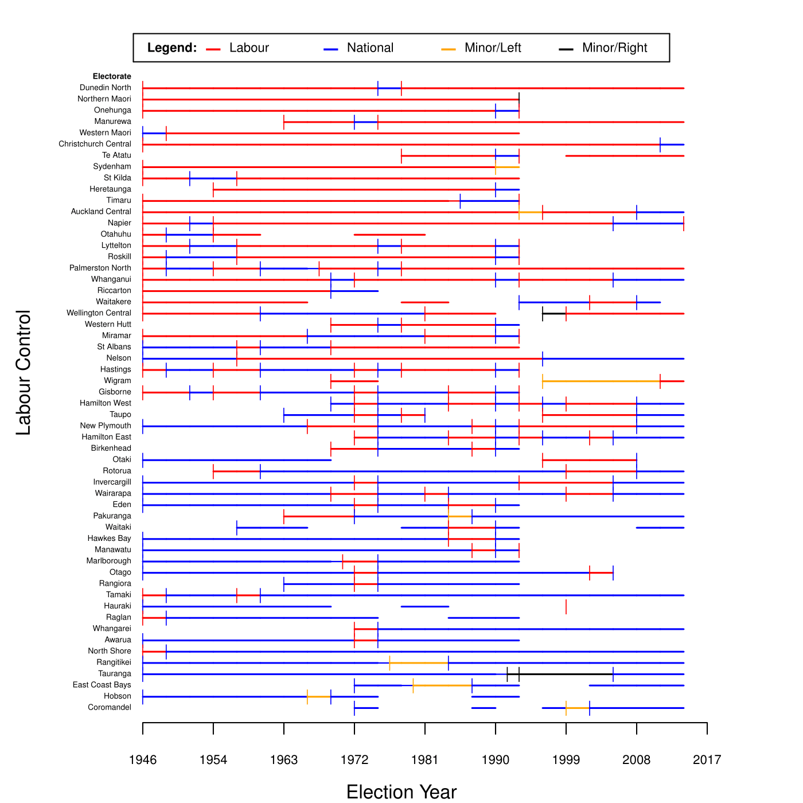

# New Zealand Election Data

This is a dataset of all electorate candidates for election in New Zealand from 1946 until the present. Beyond candidate names, party ID, electorate information, and information about who was elected, I also include columns about candidate list position, and whether the candidate served in the cabinet. Every candidate is assigned an ID so this is suitable for panel analysis of election data.

Sources are in the [sources folder](sources/), including code to merge datasets.

The resulting data is contained in [output.csv](output.csv) in the root folder here.

# Citations

Please link to this Github repository and cite as:

Rudkin, Aaron. (2017). "New Zealand Election and Cabinet Data 1946-2015"

# Contributions?

Please feel free to use a pull request to clean up the sources or alert me to missing or incorrect data.

## Timeline of contested NZ electorates

Below I present a quick visualization generated from the data. I discard non-competitive electorates. The overall visual impression is that even when selecting for competitive electorates, New Zealand electorate-level races are remarkably uncompetitive.

